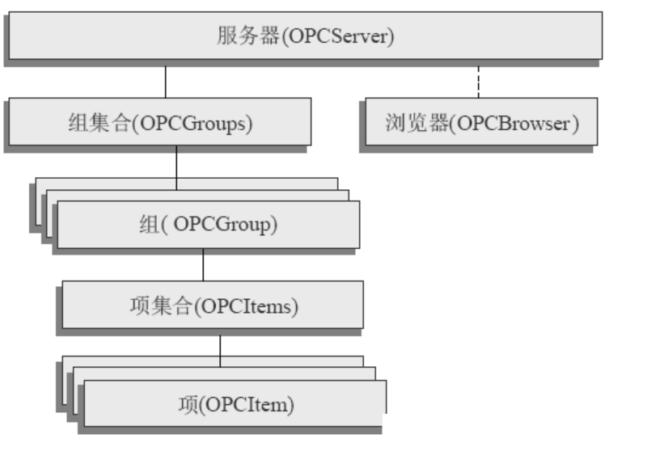

# OPC通信协议

# 1.OPC简介

OPC 全称 OLE For Process Control，即用于控制过程的 OLE，是一个工业标准，管理该标准的国际组织是 OPC 基金会。

OPC 出现的目的是为**不同的供应商设备与应用程序之间的接口标准化**从而使其间的数据交换更加简单，因此，使我们可以开发不依靠于特定开发语言和开发环境的、可以自由组合的过程控制软件。

# 2.OPC的分成层构

OPC 对象中最上层的对象是`OPC服务器`，一个OPC服务器中可以设置一个以上的`OPC组`。OPC服务器常对应于某种特定的控制设备，如DCS以及PLC等。

OPC组是可以进行数据访问的多个`OPC标签的集合`，OPC应用程序可以将需要的数据分组进行批量读取，也可以以组为单位启动或者停止数据访问。此外，OPC组还提供组内OPC标签数据`变化时`向OPC应用程序`通知`的事件。

# 3.OCP DA && OPC UA

OPC DA 与 OPC UA 都是 OPC 协议的标准

- **OPC DA** 是一种通过微软 COM/DCOM 技术来实现自动化控制的协定，采用 `C/S` 架构。开发人员只需要按照 OPC 的标准编写 OPC-Client 访问 OPC-Server 进行读写操作即可实现与硬件设备的通信。OPC 的协定中包括：

  - DA (Data Access)：访问数据的主要规范；

  - A&E (Alarm and Event)：基于事件提供Client端订阅，事件触发后Server主动提交数据；

  - HDA (History Data Access)：历史数据访问；

- **OPC UA** 是 OPC 协议的新版，其不再依赖于 COM/DCOM 技术，这意味着其具有==跨平台性==，不再局限于 Windows 系统。OPC UA 提供了可靠的通信机制，接口简单一致。

>对传统的三种不同类型OPC服务器的访问：数据访问 DA、报警和事件 AE、历史数据访问 HDA，要获得一个温度传感器的当前值、一个高温度事件和温度的历史平均值，要依次使用不同的命令执行；
>
>而使用 OPC UA，仅用一个组件就非常容易地完成了。配置和工程的时间也因此可以大大缩短。

# 4.OPC 逻辑对象模型

包括３类对象：`OPC Server`对象、`OPC Group`对象、`OPC Item`对象，每类对象都包括一系列接口。

## 4.1 OPC Server 对象

主要功能：

- 创建和管理 OPC Group 对象；
- 管理服务器内部的状态信息；

## 4.2 OPC Group 对象

主要功能：

- 创建和管理 OPC Item 对象；
- 管理 OPC Group 对象的内部状态信息；
- OPC Server 内部实时数据的读写服务；

属性：

- `name`：组名，由客户端自定义；
- `active`：组的激活状态，若为 false 则组失效，无法对服务器进行读写；
- `update rate`：更新速率（该值应大于服务器设定的最小值）；
- `percent data band`：数据死区；

> Group 分为公共组和私有组：公共组对所有连接到服务器的客户端都有效；而私有组仅对建立该组的客户端有效；

## 4.3 OPC Item 对象

主要功能：

- 用以描述实时数据，代表了与服务器数据源的连接；

属性：

- `name`：项名，在服务器中对应 Item ID；
- `active`：项的激活状态；
- `value`：项的数据值；
- `quality`：项的品质，代表数值的可信度；
- `timestamp`：时间戳，代表数据的存取事件；

>- Item 的`存储`类型为 `VARIANT`；Item 的`数据`类型为 `VARTYPE`；
>- 一个项不能被 OPC 客户端直接访问，因为 OPC 协议中没有对应于项的 COM 接口，对项的访问必须通过 OPC Group 实现；
>- Item 在服务端的定义对应于硬件的实际地址。客户端连接到服务器后创建并添加 OPC Group，并创建一系列的 OPC Item，将逻辑上等价的一组 OPC Item 添加到 OPC Group 中即可通过组对象对数据进行读写操作；

# 5.OPC通信方式

- 同步通信：OPC Client 对 OPC Server 进行读取操作时，OPC Client 必须等到 OPC Server 完成对应操作后才能返回，在此期间 OPC Client 处于一直等待的状态。
- 异步通信：OPC Client 对 OPC Server 进行读取操作时，OPC Client 发送请求后立即返回，不用等待 OPC Server，当 OPC Server 完成操作后再通知 OPC Client 程序。
- `订阅`：需要 OPC Server 支持OPC A&E规范，由 OPC Client 设定数据的`变化限度`，如果数据源的实时数据变化`超过`了该限度，OPC Server 通过回调返回数据给OPC Client。