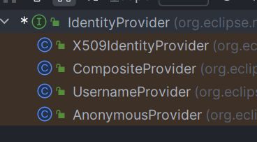
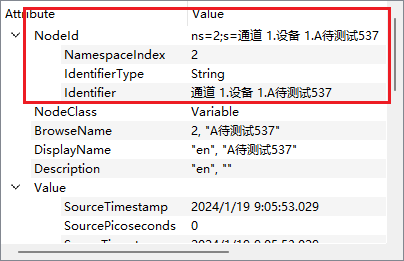
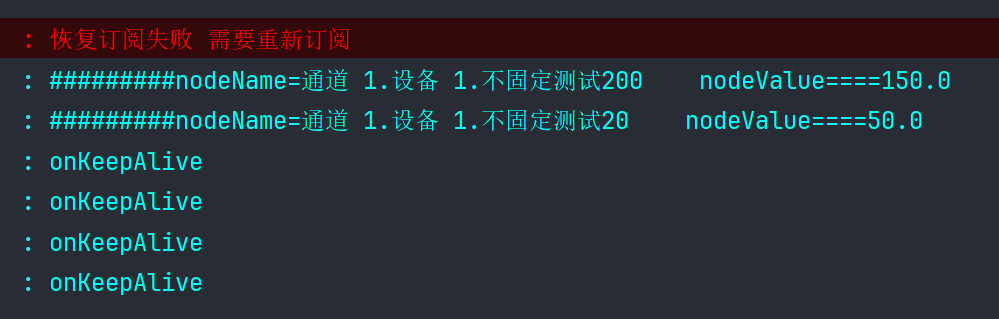

# SpringBoot实现OPC

## 1.引入依赖

`SpringBoot` 后端项目中引入 `Milo` 库依赖（客户端 `SDK` ）

```xml
        <dependency>
            <groupId>org.eclipse.milo</groupId>
            <artifactId>sdk-client</artifactId>
			<version>0.6.11</version>
        </dependency>
```


## 2.实现OPCUA客户端连接

```java
    public OpcUaClient connectOpcUaServer(String ip, String port, String suffix) throws Exception {
        String endPointUrl = "opc.tcp://" + ip + ":" + port + suffix;
        //创建了一个临时目录路径
        //存储 OPC UA 客户端可能需要的安全信息
        Path securityTempDir = Paths.get(System.getProperty("java.io.tmpdir"), "security");
        Files.createDirectories(securityTempDir);
        if (!Files.exists(securityTempDir)) {
            throw new Exception("unable to create security dir: " + securityTempDir);
        }
        OpcUaClient opcUaClient = OpcUaClient.create(endPointUrl,//要连接到并从中检索端点的服务器的端点 URL。
                //从服务器的端点列表中选择要 EndpointDescription 连接到的函数。
                endpoints ->
                        endpoints.stream()
                                //过滤出安全策略为 SecurityPolicy.None 的第一个终端节点。
                                .filter(e -> e.getSecurityPolicyUri().equals(SecurityPolicy.None.getUri()))
                                .findFirst(),
                //配置 OPC UA 客户端的一些参数
                configBuilder ->
                        configBuilder
                                //设置应用程序的名称
                                //LocalizedText:是 Eclipse Milo 中用于表示本地化文本的类，它包含了一个文本字符串和一个本地化语言标识
								 //标识性:"eclipse milo opc-ua client" 表明这是使用 Eclipse Milo 实现的 OPC UA 客户端
                                .setApplicationName(LocalizedText.english("eclipse milo opc-ua client"))
                                // 设置应用程序的 URI
                                .setApplicationUri("urn:eclipse:milo:examples:client")
                                //访问方式,设置身份提供者，这里是匿名身份提供者
                                .setIdentityProvider(new AnonymousProvider())
                                //设置请求超时时间为 5000 毫秒
                                .setRequestTimeout(UInteger.valueOf(5000))
                                .build()
        );
        //异步操作
        opcUaClient.connect().get();
        //解决 UaException: status=Bad_SessionClosed, message=The session was closed by the client.
        Thread.sleep(2000); // 线程休眠一下再返回对象，给创建过程一个时间。
        return opcUaClient;
    }
```


### 2.1 SecurityPolicy枚举类

> `SecurityPolicy` 是 OPC UA 中用于定义通信安全策略的枚举类型。它定义了在 OPC UA 通信中使用的不同安全策略，以确保通信的机密性和完整性

```java
public enum SecurityPolicy {

    /**
     * A suite of algorithms that do not provide any security settings.
     */
    None(
        "http://opcfoundation.org/UA/SecurityPolicy#None",
        SecurityAlgorithm.None,
        SecurityAlgorithm.None,
        SecurityAlgorithm.None,
        SecurityAlgorithm.None,
        SecurityAlgorithm.None,
        SecurityAlgorithm.None,
        SecurityAlgorithm.None
    ),

    /**
     * A suite of algorithms that use RSA for asymmetric encryption and AES-128 for symmetric encryption.
     */
    Basic128Rsa15(
        "http://opcfoundation.org/UA/SecurityPolicy#Basic128Rsa15",
        SecurityAlgorithm.HmacSha1,
        SecurityAlgorithm.Aes128,
        SecurityAlgorithm.RsaSha1,
        SecurityAlgorithm.Rsa15,
        SecurityAlgorithm.KwRsa15,
        SecurityAlgorithm.PSha1,
        SecurityAlgorithm.Sha1
    ),

    Basic256(
        "http://opcfoundation.org/UA/SecurityPolicy#Basic256",
        SecurityAlgorithm.HmacSha1,
        SecurityAlgorithm.Aes256,
        SecurityAlgorithm.RsaSha1,
        SecurityAlgorithm.RsaOaepSha1,
        SecurityAlgorithm.KwRsaOaep,
        SecurityAlgorithm.PSha1,
        SecurityAlgorithm.Sha1
    ),

    Basic256Sha256(
        "http://opcfoundation.org/UA/SecurityPolicy#Basic256Sha256",
        SecurityAlgorithm.HmacSha256,
        SecurityAlgorithm.Aes256,
        SecurityAlgorithm.RsaSha256,
        SecurityAlgorithm.RsaOaepSha1,
        SecurityAlgorithm.KwRsaOaep,
        SecurityAlgorithm.PSha256,
        SecurityAlgorithm.Sha256
    ),

    Aes128_Sha256_RsaOaep(
        "http://opcfoundation.org/UA/SecurityPolicy#Aes128_Sha256_RsaOaep",
        SecurityAlgorithm.HmacSha256,
        SecurityAlgorithm.Aes128,
        SecurityAlgorithm.RsaSha256,
        SecurityAlgorithm.RsaOaepSha1,
        null, // N/A
        SecurityAlgorithm.PSha256,
        SecurityAlgorithm.Sha256
    ),

    Aes256_Sha256_RsaPss(
        "http://opcfoundation.org/UA/SecurityPolicy#Aes256_Sha256_RsaPss",
        SecurityAlgorithm.HmacSha256,
        SecurityAlgorithm.Aes256,
        SecurityAlgorithm.RsaSha256Pss,
        SecurityAlgorithm.RsaOaepSha256,
        null, // N/A
        SecurityAlgorithm.PSha256,
        SecurityAlgorithm.Sha256
    );
  }
```

>- **None**:表示不使用任何安全策略，通信是明文的，不加密，不验证身份
>- **Basic128Rsa15**:使用 RSA15 进行非对称加密，使用 AES128 进行对称加密。使用的算法包括 HmacSha1、Aes128、RsaSha1、Rsa15、KwRsa15、PSha1 和 Sha1
>- **Basic256**:使用 RSA OAEP SHA1 进行非对称加密，使用 AES256 进行对称加密。使用的算法包括 HmacSha1、Aes256、RsaSha1、RsaOaepSha1、KwRsaOaep、PSha1 和 Sha1。
>- **Basic256Sha256**:使用 RSA OAEP SHA256 进行非对称加密，使用 AES256 进行对称加密。使用的算法包括 HmacSha256、Aes256、RsaSha256、RsaOaepSha1、KwRsaOaep、PSha256 和 Sha256。
>- **Aes128_Sha256_RsaOaep**:使用 RSA OAEP SHA256 进行非对称加密，使用 AES128 进行对称加密。使用的算法包括 HmacSha256、Aes128、RsaSha256、RsaOaepSha1、PSha256 和 Sha256。
>- **Aes256_Sha256_RsaPss:**使用 RSA PSS SHA256 进行非对称加密，使用 AES256 进行对称加密。使用的算法包括 HmacSha256、Aes256、RsaSha256Pss、RsaOaepSha256、PSha256 和 Sha256。


### 2.2 IdentityProvider接口

> 该接口用于提供身份验证相关的信息，包括用户身份令牌（`UserIdentityToken`）和签名数据（`SignatureData`）。这个接口的目的是为 OPC UA 会话的激活过程提供身份验证所需的令牌和签名信息。

```java
public interface IdentityProvider {
    // endpoint 是要连接的终端节点的描述信息。
    // serverNonce 是服务器生成的随机数，客户端可能需要用它来创建身份令牌。
    SignedIdentityToken getIdentityToken(EndpointDescription endpoint, ByteString serverNonce) throws Exception;
}
```

四个实现类:


>- AnonymousProvider:匿名访问,适用于那些不需要用户身份验证，允许匿名访问的情况。在这种情况下，`getUserIdentityToken` 返回一个匿名用户身份令牌。
>- UsernameProvider：用户名/密码身份验证，适用于需要基于用户名和密码进行身份验证的场景。
>- X509IdentityProvider：X.509 证书身份验证，用于基于 X.509 证书进行身份验证的场景。
>- CompositeProvider：组合身份提供者，按照提供的顺序依次尝试其组件身份提供者，直到找到一个成功的提供者或所有提供者都失败。


## 3.遍历节点

```java
   /**
     * 遍历树形节点
     *
     * @param client OPC UA客户端
     * @param uaNode 节点
     * @throws Exception
     */
    public void listNode(OpcUaClient client, UaNode uaNode) throws Exception {
        List<? extends UaNode> nodes;
        if (uaNode == null) {
            nodes = client.getAddressSpace().browseNodes(Identifiers.ObjectsFolder);
        } else {
            nodes = client.getAddressSpace().browseNodes(uaNode);
        }
        for (UaNode nd : nodes) {
            //排除系统性节点，这些系统性节点名称一般都是以"_"开头
            if (Objects.requireNonNull(nd.getBrowseName().getName()).contains("_")) {
                continue;
            }
            System.out.println("Node= " + nd.getBrowseName().getName());
            listNode(client, nd);
        }
    }
```


## 4.读取节点数据

> node 中的数据



```java
   /**
     * 读取节点数据
     *
     * namespaceIndex可以通过UaExpert客户端去查询，一般来说这个值是2。
     * identifier也可以通过UaExpert客户端去查询，这个值=通道名称.设备名称.标记名称
     *
     * @param client
     * @param namespaceIndex
     * @param identifier
     * @throws Exception
     */
    public void readNodeValue(OpcUaClient client, int namespaceIndex, String identifier) throws Exception {
        //节点
        NodeId nodeId = new NodeId(namespaceIndex, identifier);

        //读取节点数据
        //1.maxAge: 表示最大时效性（Max Age）。它定义了从缓存中读取数据的最大时效性，即可以接受的数据的最大老化时间。传递 0.0 表示不接受缓存中		   //的数据，强制从服务器获取最新的数据。
        //2.timestampsToReturn:表示客户端希望在返回的数据中包含的时间戳的类型
        //3.nodeId: 表示要读取的节点的标识符
        DataValue value = client.readValue(0.0, TimestampsToReturn.Neither, nodeId).get();

        // 状态
        System.out.println("Status: " + value.getStatusCode());

        //标识符
        String id = String.valueOf(nodeId.getIdentifier());
        System.out.println(id + ": " + value.getValue().getValue());
    }
```


### 4.1 TimestampsToReturn枚举类

> TimestampsToReturn枚举类:

```java
public enum TimestampsToReturn implements UaEnumeration {
    Source(0),

    Server(1),

    Both(2),

    Neither(3),

    Invalid(4);
}
```

>- **Source(0)**:要求服务器返回源时间戳,即返回数据的原始产生时间戳，表示数据生成的时间。
>- **Server(1)**:要求服务器返回服务器时间戳,即返回数据最后一次写入服务器的时间戳，表示数据在服务器上被更新的时间
>- **Both(2)**:要求服务器同时返回源时间戳和服务器时间戳。
>- **Neither(3)**:不要求服务器返回任何时间戳
>- **Invalid(4):**表示无效的时间戳返回选项。


## 5. 写入节点数据

```java
    /**
     * 写入节点数据
     *
     * @param client
     * @param namespaceIndex
     * @param identifier
     * @param value
     * @throws Exception
     */
    public void writeNodeValue(OpcUaClient client, int namespaceIndex, String identifier, Float value) throws Exception {
        //节点
        NodeId nodeId = new NodeId(namespaceIndex, identifier);
        //创建数据对象,此处的数据对象一定要定义类型，不然会出现类型错误，导致无法写入
        //Variant 是 OPC UA 中用于表示数据值的通用类型
        //质量和时间戳
        DataValue newValue = new DataValue(new Variant(value), null, null);
        //写入节点数据
		//使用 .join() 方法等待写入操作的完成，该方法将阻塞当前线程，直到写入操作完成或发生异常。
        StatusCode statusCode = client.writeValue(nodeId, newValue).join();
        System.out.println("结果：" + statusCode.isGood());
    }
```


## 6. 订阅模式

```java
@Slf4j
@Component
public class OpcUaSubHandler {

    /**
     * 默认请求的发布间隔 1s
     */
    private static final double DEFAULT_REQUESTED_PUBLISHING_INTERVAL = 1000.0;

    /**
     * 默认队列大小
     */
    private static final int DEFAULT_QUEUE_SIZE = 10;

    /**
     * 默认采样间隔(毫秒)
     */
    private static final double DEFAULT_SAMPLING_INTERVAL = 1000.0;

    /**
     * 批量处理订阅业务
     *
     * @param opcUaClient OPC UA客户端
     * @param nodeIdList  要订阅的节点集合
     */
    public void handlerMultipleNode(OpcUaClient opcUaClient, List<NodeId> nodeIdList) throws ExecutionException, InterruptedException {
        OpcUaSubscriptionManager subscriptionManager = opcUaClient.getSubscriptionManager();
        UaSubscription subscription = subscriptionManager.createSubscription(DEFAULT_REQUESTED_PUBLISHING_INTERVAL).get();
        List<MonitoredItemCreateRequest> monitoredItemCreateRequests = new ArrayList<>();
        int i = 1;
        for (NodeId nodeId : nodeIdList) {
            //NodeId： 表示要读取的节点的标识符
            //AttributeId：表示要读取的节点属性的标识符 --> AttributeId.Value.uid() 表示读取节点的值属性
            //IndexRange：表示要读取的节点数组的范围。如果为数组类型，可以使用 IndexRange 来指定要读取的数组元素的范围，null表示读取整个数组
            //DataEncoding： 表示读取节点时应使用的数据编码。 null表示默认的数据编码
            ReadValueId readValueId = new ReadValueId(nodeId, AttributeId.Value.uid(), null, null);
            MonitoringParameters parameters = new MonitoringParameters(
                    uint(1 + i),                       // 为了保证唯一性而设置的监控项标识符,监听多个要设置唯一性
                    DEFAULT_SAMPLING_INTERVAL,         // 采样间隔，0表示尽可能快地采样
                    null,                              // 过滤器，这里设置为null表示使用默认过滤器。
                    uint(DEFAULT_QUEUE_SIZE),          // 队列大小，表示最多保存n个数据项的历史数据,该设置RequestedQueueSize表示客户														//端期望服务器为该订阅分配的队列大小，但是服务器端在接收到订阅请求后，如果发现客户													     //端请求的队列大小不合适，可能会进行调整，并通过RevisedQueueSize参数告知客户端														//实际分配的队列大小。
                    true                               // 如果队列满，则丢弃最旧的数据项。
            );
            i++;
            //MonitoringMode： 表示监视模式。在OPC UA中，有两种监视模式，分别是MonitoringMode.Sampling和 onitoringMode.Reporting。
            //Sampling模式 表示按照指定的采样间隔获取数据，而 eporting模式表示在数据发生变化时报告。
            MonitoredItemCreateRequest request = new MonitoredItemCreateRequest(readValueId, MonitoringMode.Sampling, parameters);
            monitoredItemCreateRequests.add(request);
        }
        //创建监控项，并且注册变量值改变时候的回调函数。
        List<UaMonitoredItem> items = subscription.createMonitoredItems(
                TimestampsToReturn.Both, //表示客户端希望在监视项中包含的时间戳的类型,这里表示希望返回源时间戳和服务器时间戳。
                newArrayList(monitoredItemCreateRequests),
                (item, id) -> { // 表示一个消费者函数，用于处理创建监视项后的每个UaMonitoredItem 对象及其对应的标识符 UInteger
                    // 设置监视项的值消费者，处理数值变化
                    item.setValueConsumer((is, value) -> {
                        String nodeName = item.getReadValueId().getNodeId().getIdentifier().toString();
                        String nodeValue = value.getValue().getValue().toString();
                        log.info("#########nodeName=" + nodeName + "    nodeValue====" + nodeValue);
                    });
                }).get();//等待异步操作完成,没有这个get()，只能得到一两次消息更新
    }
}
```


### 6.1 MonitoringMode 监听模式

```java
public enum MonitoringMode implements UaEnumeration {
    Disabled(0),

    Sampling(1),

    Reporting(2);
 }
```

> - **Disabled** :表示监视项被禁用，不进行数据采样或报告。
> - **Sampling** ：表示监视项处于采样模式，即周期性地对节点进行数据采样，但只在`客户端请求时产生通知`。采样后的数据并不会立即发送给客户端。相反，当客户端请求监视项的数据时，服务器将返回最近一次采样的数据，从而触发通知。客户端可以周期性地请求监视项的当前值，以获取最新的数据。
> - **Reporting** :表示监视项处于报告模式，即在`数据变化时向客户端报告`，不需要客户端主动请求。


### 6.2 断线恢复订阅

正常情况下通过`OpcUaClient`去订阅，没问题，但是当服务端断开之后，milo会抛出异常，当服务端重新启动成功后，`OpcUaClient`可以自动断线恢复，但是恢复之后会发现之前订阅的数据没法访问了。要解决这个问题，只需要断线重连后重新订阅即可。


#### 6.2.1 自定义订阅监听

```java
@Slf4j
public class CustomSubscriptionListener implements UaSubscriptionManager.SubscriptionListener {

    private OpcUaSubHandler opcUaSubHandler;

    private OpcUaClient client;

    public CustomSubscriptionListener(OpcUaSubHandler opcUaSubHandler, OpcUaClient client) {
        this.opcUaSubHandler = opcUaSubHandler;
        this.client = client;
    }

    /**
     * 已收到保持活动状态消息
     *
     * @param subscription the {@link UaSubscription} that received the keep-alive.
     * @param publishTime  the time the server published the keep-alive.
     */
    public void onKeepAlive(UaSubscription subscription, DateTime publishTime) {
        log.info("onKeepAlive");
    }

    /**
     * 已收到状态更改通知
     *
     * @param subscription the {@link UaSubscription} that received the status change.
     * @param status       the new subscription status.
     */
    public void onStatusChanged(UaSubscription subscription, StatusCode status) {
        log.info("onStatusChanged");
    }

    /**
     * 发布失败
     *
     * @param exception 失败的原因
     */
    public void onPublishFailure(UaException exception) {
        log.info("onPublishFailure");
    }

    /**
     * 尝试恢复丢失的通知数据失败
     *
     * @param subscription 错过通知数据的订阅
     */
    public void onNotificationDataLost(UaSubscription subscription) {
        log.info("onNotificationDataLost");
    }

    /**
     * 重连时 尝试恢复之前的订阅失败时 会调用此方法
     *
     * @param uaSubscription 订阅
     * @param statusCode     状态
     */
    public void onSubscriptionTransferFailed(UaSubscription uaSubscription, StatusCode statusCode) {
        log.error("恢复订阅失败 需要重新订阅");
        //在回调方法中重新订阅
        OpcUaSubscription opcUaSubscription = (OpcUaSubscription) uaSubscription;
        List<NodeId> nodeIdList = new ArrayList<>();
        ImmutableList<UaMonitoredItem> monitoredItems = opcUaSubscription.getMonitoredItems();
        monitoredItems.forEach(monitoredItem -> {
            nodeIdList.add(monitoredItem.getReadValueId().getNodeId());
        });
        try {
            //重新订阅节点
            opcUaSubHandler.handlerMultipleNode(client, nodeIdList);
        } catch (ExecutionException | InterruptedException e) {
            log.error("重新订阅失败", e);
        }
    }

}
```


#### 6.2.2 在订阅的时候添加监听器

```java
OpcUaSubscriptionManager subscriptionManager = opcUaClient.getSubscriptionManager();
//添加自定义监听
subscriptionManager.addSubscriptionListener(new CustomSubscriptionListener(this, opcUaClient));
UaSubscription subscription = subscriptionManager.createSubscription(DEFAULT_REQUESTED_PUBLISHING_INTERVAL).get();
```


#### 6.2.3 测试

```java
@Override
public void run(ApplicationArguments args) throws Exception {
    OpcUaClient opcUaClient = connectOpcUaServer("10.10.12.98", "49322", "");
    //添加订阅监听器，用于处理断线重连后的订阅问题
    NodeId nodeId1 = new NodeId(2, "通道 1.设备 1.不固定测试200");
    NodeId nodeId2 = new NodeId(2, "通道 1.设备 1.不固定测试20");
    opcUaSubHandler.handlerMultipleNode(opcUaClient, new ArrayList<>(Arrays.asList(nodeId1, nodeId2)));
    Thread.sleep(1000 * 20);
    log.error("关闭");
    opcUaClient.disconnect();
    Thread.sleep(1000 * 20);
    log.info("重新连接");
    opcUaClient.connect();
}
```

测试结果:

