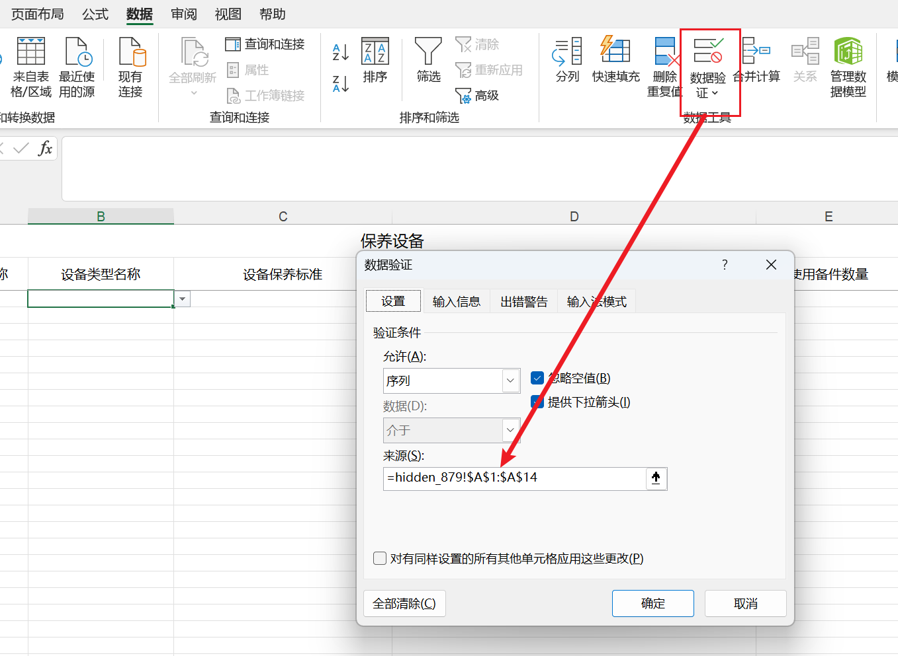

# 生成下拉选项

Excel生成下拉列表方式:

- 使用隐藏sheet结合公式来生成



> 使用easypoi来辅助Excel的生成

```xml
<dependency>
    <groupId>org.apache.poi</groupId>
    <artifactId>poi</artifactId>
    <version>4.1.2</version>
</dependency>
<dependency>
    <groupId>org.apache.poi</groupId>
    <artifactId>poi-ooxml</artifactId>
    <version>4.1.2</version>
</dependency>
<dependency>
    <groupId>org.apache.poi</groupId>
    <artifactId>poi-ooxml-schemas</artifactId>
    <version>4.1.2</version>
</dependency>
```


## 一.单下拉框生成

### 1.准备模板

```java
Data
public class EquipmentStandardMaintenanceExcel {
    /**
     * 设备保养部位名称
     */
    @Excel(name = "设备保养部位名称", width = 20)
    private String equMaintainPart;

    /**
     * 设备类型名称
     */
    @Excel(name = "设备类型名称", width = 20)
    private String equTypeName;

    /**
     * 设备保养标准
     */
    @Excel(name = "设备保养标准", width = 30)
    private String equMaintainStandard;

    /**
     * 使用备件名称
     */
    @Excel(name = "使用备件名称", width = 50)
    private String sparepartName;

    /**
     * 使用备件数量
     */
    @Excel(name = "使用备件数量", width = 20)
    private String sparepartNum;
}
```

### 2.导出方法

```java
    public static void main(String[] args) {
        String title = "保养设备";
        String fileName = "保养设备导入模板.xlsx";
		Workbook workbook = ExcelExportUtil.exportExcel(new ExportParams(title, title, ExcelType.XSSF), 	                                                                         EquipmentStandardMaintenanceExcel.class, Collections.EMPTY_LIST);
        //查询设备类型,作为下拉选项
		List<String> equipmentTypeList = currencyExtMapper.queryEquipmentType().stream()
        								.map(SelectVO::getName).collect(Collectors.toList());
        ExcelUtil.selectList(workbook, 2, 65535, 1, 1, equipmentTypeList, 1);
        FileOutputStream outputStream = new FileOutputStream("D:\\" + fileName);
        workbook.write(outputStream);
        outputStream.close();
    }
```

### 3.设置隐藏sheet和公式

```java
    /**
     * firstRow 开始行号(下标0开始)
     * lastRow  结束行号，最大65535
     * firstCol 区域中第一个单元格的列号 (下标0开始)
     * lastCol 区域中最后一个单元格的列号
     * dataArray 下拉内容
     * sheetHidden 隐藏的sheet编号（例如1,2,3），多个下拉数据不能使用同一个
     */
    public static void selectList(Workbook workbook, int firstRow, int lastRow, int firstCol, int lastCol, List<String> dataList, int sheetHidden) {
		//生成隐藏sheet
        String hiddenName = "hidden_" + (int) ((Math.random() * 9 + 1) * 100);
        Sheet sheet = workbook.getSheetAt(0);
        Sheet hidden = workbook.createSheet(hiddenName);
        Cell cell = null;
	    //填充数据
        for (int i = 0, length = dataList.size(); i < length; i++) {
            String name = dataList.get(i);
            Row row = hidden.createRow(i);
            cell = row.createCell(0);
            cell.setCellValue(name);
        }
        
        //创建名称管理器
        Name name = workbook.createName();
        //名称
        name.setNameName(hiddenName);
        String formula = hiddenName + "!$A$1:$A$" + dataList.size();
        //引用位置
        name.setRefersToFormula(formula);
        
        DataValidationHelper dataValidationHelper = sheet.getDataValidationHelper();
        //添加公式约束
        DataValidationConstraint formulaListConstraint = 
            			dataValidationHelper.createFormulaListConstraint(formula);
        // 设置数据有效性加载在哪个单元格上,四个参数分别是：起始行、终止行、起始列、终止列
        CellRangeAddressList addressList = new CellRangeAddressList(firstRow, lastRow, firstCol, lastCol);
        // 将sheet设置为隐藏
        workbook.setSheetHidden(sheetHidden, true);
        DataValidation validation = dataValidationHelper.createValidation(formulaListConstraint, addressList);
        sheet.addValidationData(validation);
    }
```


## 二.DataValidationHelper接口

```java
public interface DataValidationHelper {
    // 创建公式列表约束规则
    DataValidationConstraint createFormulaListConstraint(String var1);
    // 创建显式列表约束规则
    DataValidationConstraint createExplicitListConstraint(String[] var1);
    // 创建数值约束规则
    DataValidationConstraint createNumericConstraint(int var1, int var2, String var3, String var4);
    // 创建文本长度约束规则
    DataValidationConstraint createTextLengthConstraint(int var1, String var2, String var3);
    // 创建十进制约束规则
    DataValidationConstraint createDecimalConstraint(int var1, String var2, String var3);
    // 创建整数制约束规则
    DataValidationConstraint createIntegerConstraint(int var1, String var2, String var3);
    // 创建日期制约束规则
    DataValidationConstraint createDateConstraint(int var1, String var2, String var3, String var4);
    // 创建时间约束规则
    DataValidationConstraint createTimeConstraint(int var1, String var2, String var3);
    // 创建自定义约束规则
    DataValidationConstraint createCustomConstraint(String var1);
    // 创建验证规则
    DataValidation createValidation(DataValidationConstraint var1, CellRangeAddressList var2);
}
```

- 使用时可以先用`sheet`对象获取到验证助手，然后通过验证助手接口中定义的规则创建不同的验证策略。

```java
 DataValidationHelper dvHelper = sheet.getDataValidationHelper();
```

- 创建好了验证策略以后再使用验证助手创建验证规则

```java
//创建了一个数据验证约束，用于验证用户输入是否为整数，并且限制输入的范围在1到100之间
DataValidationConstraint numericConstraint = dvHelper.createNumericConstraint(
    DataValidationConstraint.ValidationType.INTEGER, //
    DataValidationConstraint.OperatorType.BETWEEN, 
    "1", "100");
```

- 创建好了验证策略以后再使用验证助手创建验证规则，并设置验证错误的提示

```java
// 设置数据有效性加载在哪个单元格上,四个参数分别是：起始行、终止行、起始列、终止列
CellRangeAddressList addressList = new CellRangeAddressList(firstRow, lastRow, firstCol, lastCol);
DataValidation dataValidation = helper.createValidation(constraint, addressList);
dataValidation.setErrorStyle(DataValidation.ErrorStyle.STOP);
dataValidation.setShowErrorBox(true);
dataValidation.setSuppressDropDownArrow(true);
dataValidation.createErrorBox(msgHead, msgContext);
sheet.addValidationData(dataValidation);
```


## 三.DataValidationConstraint接口

在创建数值约束（`createNumericConstraint`）时，需要传递一些int类型数值。

而如何传递这些数值需要参考这个类：`DataValidationConstraint`。它也是一个接口，源码如下：

> 这个接口中有两个内部类，`OperatorType`操作类型的内部类和`ValidationType`验证类型的内部类。

```java
public interface DataValidationConstraint {
    int getValidationType();

    int getOperator();

    void setOperator(int var1);

    String[] getExplicitListValues();

    void setExplicitListValues(String[] var1);

    String getFormula1();

    void setFormula1(String var1);

    String getFormula2();

    void setFormula2(String var1);

	public static final class OperatorType {
		private OperatorType() {
			// no instances of this class
		}

		public static final int BETWEEN = 0x00; //表示范围在两个值之间的操作
		public static final int NOT_BETWEEN = 0x01; //表示范围不在两个值之间的操作
		public static final int EQUAL = 0x02;  //表示相等的操作
		public static final int NOT_EQUAL = 0x03; //表示不相等的操作
		public static final int GREATER_THAN = 0x04; //表示大于的操作
		public static final int LESS_THAN = 0x05; //表示小于的操作
		public static final int GREATER_OR_EQUAL = 0x06; //表示大于或等于的操作
		public static final int LESS_OR_EQUAL = 0x07; //表示小于或等于的操作
		/** default value to supply when the operator type is not used */
		public static final int IGNORED = BETWEEN; //表示当操作类型未被使用时提供的默认值，默认为 BETWEEN。
		
		/* package */ public static void validateSecondArg(int comparisonOperator, String paramValue) {
			switch (comparisonOperator) {
				case BETWEEN:
				case NOT_BETWEEN:
					if (paramValue == null) {
						throw new IllegalArgumentException("expr2 must be supplied for 'between' comparisons");
					}
				// all other operators don't need second arg
			}
		}
	}

	public static final class ValidationType {
		private ValidationType() {
			// no instances of this class
		}
		/** 'Any value' type - value not restricted */
		public static final int ANY         = 0x00; //表示值不受限制的验证类型。
		/** Integer ('Whole number') type */
		public static final int INTEGER     = 0x01; //表示整数（'整数'）类型的验证。
		/** Decimal type */
		public static final int DECIMAL     = 0x02; //表示十进制类型的验证。
		/** List type ( combo box type ) */
		public static final int LIST        = 0x03; //表示列表类型（下拉框类型）的验证。
		/** Date type */
		public static final int DATE        = 0x04; //表示日期类型的验证。
		/** Time type */
		public static final int TIME        = 0x05; //表示时间类型的验证。
		/** String length type */
		public static final int TEXT_LENGTH = 0x06; //表示字符串长度类型的验证。
		/** Formula ( 'Custom' ) type */
		public static final int FORMULA     = 0x07; //表示公式（'自定义'）类型的验证。
	}
}
```

